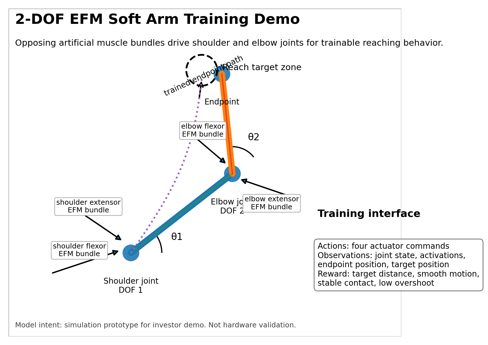
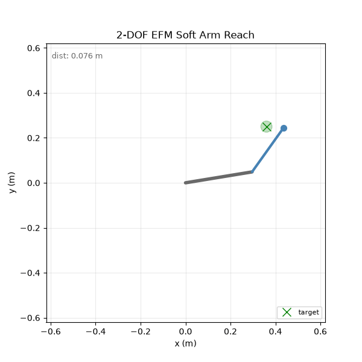
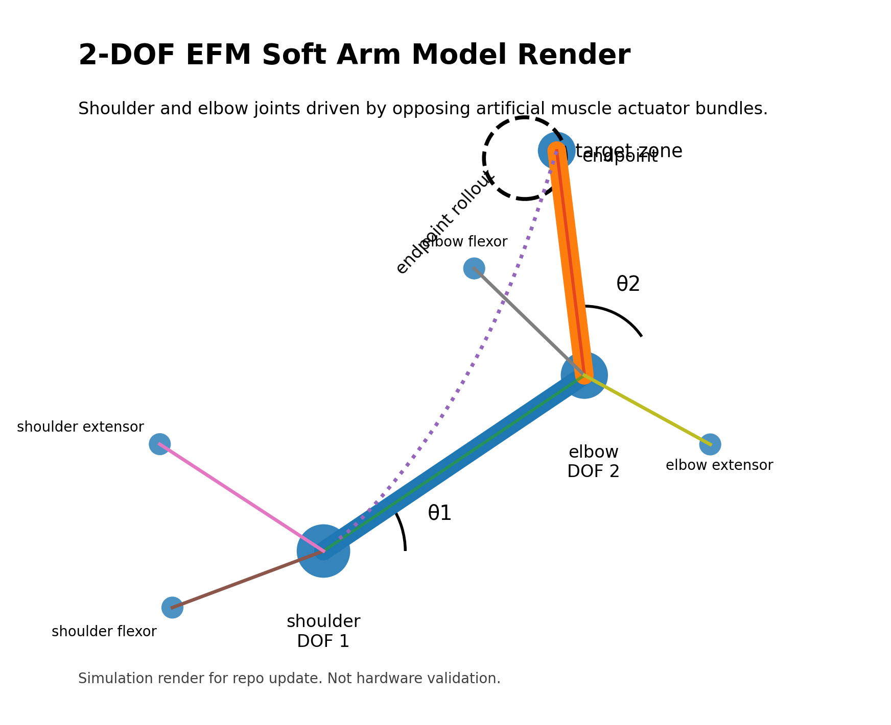
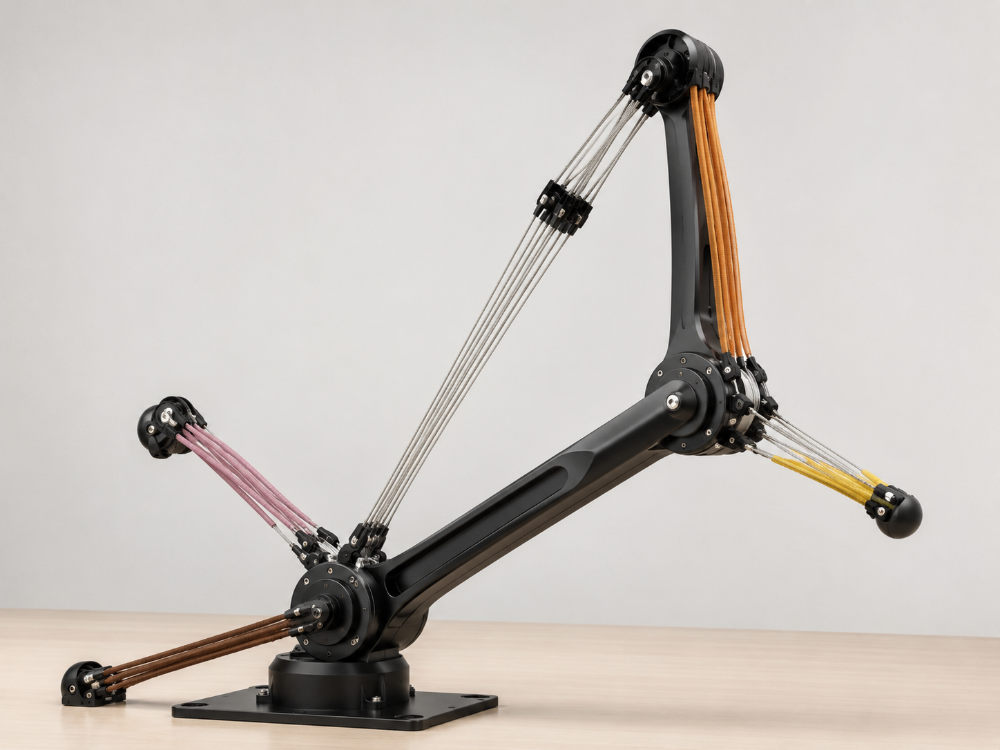
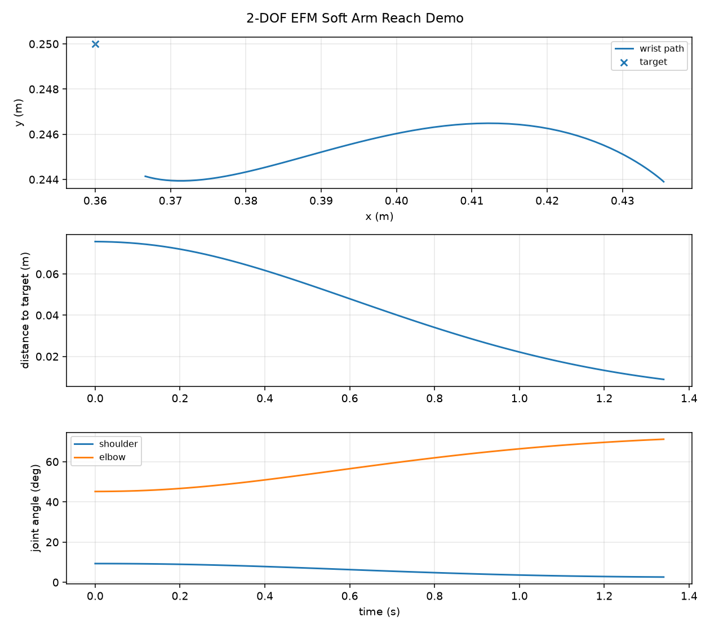
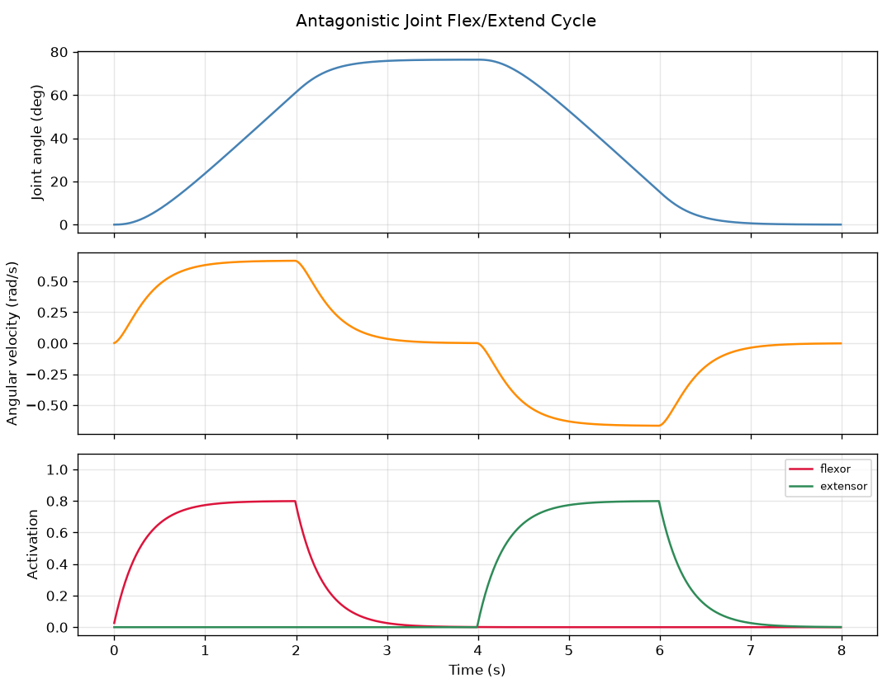

# efm-muscle-sim

A Python simulation of electrofluidic fiber muscle (EFM) style actuation for robotics concept work.

**New here? Start with [QUICKSTART.md](QUICKSTART.md).**

Not affiliated with MIT, Politecnico di Bari, Science Robotics, or the original paper authors. This is an independent abstraction built from public information in the paper and MIT news release.

---

## 2-DOF soft arm training demo



A two-joint planar arm (shoulder and elbow) each driven by an opposing pair of EFM muscles, built directly on top of the actuator and joint model below. Instead of a single actuator moving in isolation, four muscles coordinate through two joints to move a wrist endpoint toward a target.

This is a simulation and training prototype, not a validated physical simulator. The concept render below is for presentation context only, not hardware.

**Geometry.** Two rigid links (0.30 m upper arm, 0.24 m forearm) connected at shoulder and elbow joints. Each joint has its own moment arm, inertia, and damping, and is driven by a flexor/extensor muscle pair using the same `AntagonisticJoint` model as the 1-DOF demo.

**Control interface.** A 4-value action in [0, 1]: `[shoulder_flex, shoulder_extend, elbow_flex, elbow_extend]`. Co-contracting both muscles in a pair stiffens the joint without moving it, matching physical actuator behavior.

**Training environment.** `SoftArmReachEnv` is a Gymnasium-compatible environment with:
- a 16-value observation: joint angles, joint velocities, wrist position, target position, position error, contact force, and all four muscle activation levels
- a reward combining distance to target, velocity penalty, action-effort penalty, and co-contraction penalty, with a bonus for holding the target
- optional dynamics randomization (response time, max force, stiffness, damping) to avoid overfitting to a single fixed actuator
- optional contact wall modeled as a spring-damper, for training against endpoint pushback

**Scripted demo result.** A deterministic IK + PD controller reaches within 0.009 m of the target in under 300 steps.



**2-DOF arm geometry.** Shoulder and elbow joints, link lengths, and wrist endpoint.



**Concept render.** 3D illustration for presentation context only. Not a photo of hardware.



**Sample rollout output.** Plot generated by `run_2dof_soft_arm_rollout.py` showing wrist path, distance to target over time, and joint angles.



Full engineering writeup: `docs/2dof_soft_arm_training_demo.md`

---

## Repo layout

### Core package: `src/efm_muscle_sim/`

| File | What it does |
|---|---|
| `parameters.py` | `ElectroFluidicMuscleParams` and `AntagonisticJointParams` dataclasses. Holds all tunable values: contraction strain, response time, force, stiffness, damping. Values from the paper are marked; placeholders are labeled. |
| `actuator.py` | `ElectroFluidicMuscle` -- single muscle bundle model. Takes a control input 0-1 and steps forward in time, producing activation, contraction, and force. |
| `joint.py` | `AntagonisticJoint` -- one degree of freedom hinge driven by a flexor/extensor muscle pair. Handles torque balance, damping, and angle limits. |
| `soft_arm.py` | `SoftArm2D` -- two-link planar arm with shoulder and elbow joints, each an `AntagonisticJoint`. Includes forward kinematics and an endpoint Jacobian for force-to-torque mapping. |
| `training_env.py` | `SoftArmReachEnv` -- Gymnasium-compatible environment wrapping `SoftArm2D`. 16-value observation, 4-value action, configurable reward, dynamics randomization, and optional contact wall. |
| `simulation.py` | `run_simulation` and `save_csv` utilities for driving any model through a control sequence and writing results. |
| `plotting.py` | `plot_actuator_response` and `plot_joint_response` for generating the 1-DOF output plots. |
| `units.py` | Unit conversion helpers (rad/deg, N/kgf, m/mm). |

### Examples: `examples/`

| File | What it does |
|---|---|
| `run_2dof_soft_arm_rollout.py` | Scripted IK+PD demo of the 2-DOF arm reaching a target. No training required. Writes CSV and PNG. |
| `render_2dof_soft_arm_gif.py` | Same rollout rendered as an animated GIF. |
| `train_2dof_soft_arm_ppo.py` | PPO training loop using stable-baselines3. Requires `pip install gymnasium stable-baselines3`. |
| `run_actuator_step_response.py` | Single muscle step response demo. |
| `run_antagonistic_joint_demo.py` | 1-DOF joint alternating flexor/extensor demo. |
| `run_parameter_sweep.py` | Sweeps bundle count and force to show sensitivity to placeholder values. |

### Documentation: `docs/`

| File | What it covers |
|---|---|
| `2dof_soft_arm_training_demo.md` | Full writeup: model structure, action/obs/reward tables, dynamics randomization, scripted vs RL, what the demo does not prove. |
| `mujoco_integration.md` | How to wire the Python model to the MuJoCo XML arm. Covers gain calculation and controller wiring. |
| `repo_handoff.md` | Engineer orientation: where to start, what needs fitting, what is and is not validated. |

---

## What it models

Each muscle bundle is a compliant linear actuator with first-order activation lag. You set a control input between 0 and 1, and the model handles contraction rate, force output, passive compliance, and damping. Two muscles in opposition drive a single-joint arm model.

It does not simulate pump internals, fluid pressure, cavitation, or material deformation. Force and damping values are placeholders until fitted against the Zenodo dataset (`scripts/fit_parameters.py`).

## Setup

```
git clone https://github.com/joetol2/efm-muscle-sim.git
cd efm-muscle-sim
python -m venv .venv
source .venv/bin/activate   # Windows: .venv\Scripts\activate
pip install -e .
```

Optional extras:

```
pip install mujoco                          # MuJoCo example
pip install gymnasium stable-baselines3     # PPO training
pip install scipy                           # parameter fitting
```

See [QUICKSTART.md](QUICKSTART.md) for run commands, expected outputs, and the full repo layout.

## Using the Python model directly

```python
from efm_muscle_sim import ElectroFluidicMuscle, ElectroFluidicMuscleParams

params = ElectroFluidicMuscleParams(bundle_count=4, max_force_per_fiber_n=1.0)
muscle = ElectroFluidicMuscle(params)

for _ in range(100):
    state = muscle.step(control=1.0, dt=0.01)

print(state["activation"])
print(state["current_contraction_strain"])
print(state["total_force_n"])
```

## MuJoCo

The XML model is at `models/mujoco/efm_biceps_triceps_arm.xml`. It loads and runs, but the actuator gain is a placeholder and the Python model is not yet wired to it. Read `docs/mujoco_integration.md` before using this in a real sim. It covers gain calculation, controller wiring, and what still needs fitting.


## Simulation outputs

**Single muscle step response.** Activation builds with the 0.3 s lag, contraction strain follows, force tracks activation.


**Antagonistic joint demo.** Flexor and extensor activations alternate to bend and release the joint.



## Parameters

Contraction strain (20%), response time (0.3 s), fiber diameter (2 mm), and power density (50 W/kg) come from the published paper. Force, stiffness, and damping are placeholders. See `src/efm_muscle_sim/parameters.py` for the full list and `scripts/fit_parameters.py` for the fitting workflow.

## Data sources

Science Robotics, DOI: 10.1126/scirobotics.ady6438

MIT News: https://news.mit.edu/2026/new-type-electrically-driven-artificial-muscle-fiber-0409

Zenodo v2 dataset (~461 MB): https://zenodo.org/records/18678491

Download locally with `python scripts/fetch_zenodo_dataset.py`. Do not commit it to the repo.

See NOTICE.md for attribution and non-affiliation details.
